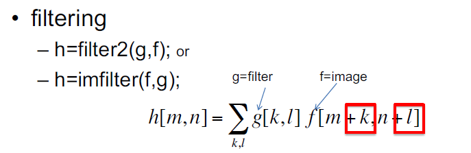
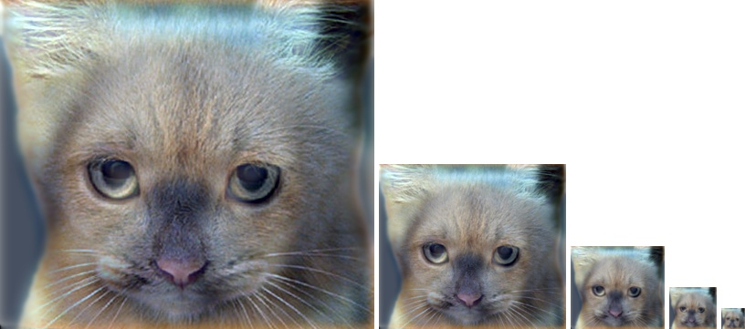
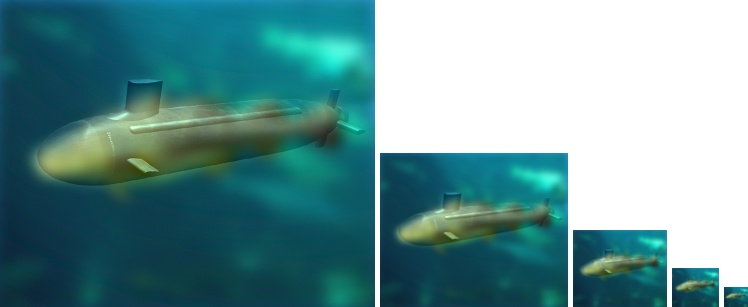

# 蔡介豪 <span style="color:red">(103061101)</span>

# DSP Lab HW 1 / Image Filtering and Hybrid Images

## Overview
The project is related to image filtering and hybird images.


## Implementation
1. ```my_imfilter```
	* 
	* Expand the original image with padding for the filtering process
	* Then preform the formula

		 <pre><code>for m = 1:i_height
		   for n = 1:i_width
		       
		       for k = 1:f_height
		           for l = 1:f_width
		               R_out(m, n) = R_out(m, n) + filter(k, l)*R_pad(m+k, n+l);
		               G_out(m, n) = G_out(m, n) + filter(k, l)*G_pad(m+k, n+l);
		               B_out(m, n) = B_out(m, n) + filter(k, l)*B_pad(m+k, n+l);
		           end
		       end
		   end
		end</code></pre>

2. ```proj1```
	* Use ```my_imfilter``` to implement Gaussian filter
	* Remove high frequency component to obtain ```low_frequencies```
	* Remove low frequency component to obtain ```high_frequencies```
	* Combine ```low_frequencies``` and ```high_frequencies``` to create ```hybrid_image```
	* <pre><code>hybrid_image = low_frequencies + high_frequencies;</code></pre>

### Results

<table border=1>
<tr>
<td>

</td>
</tr>

<tr>
<td>

</td>
</tr>

</table>
